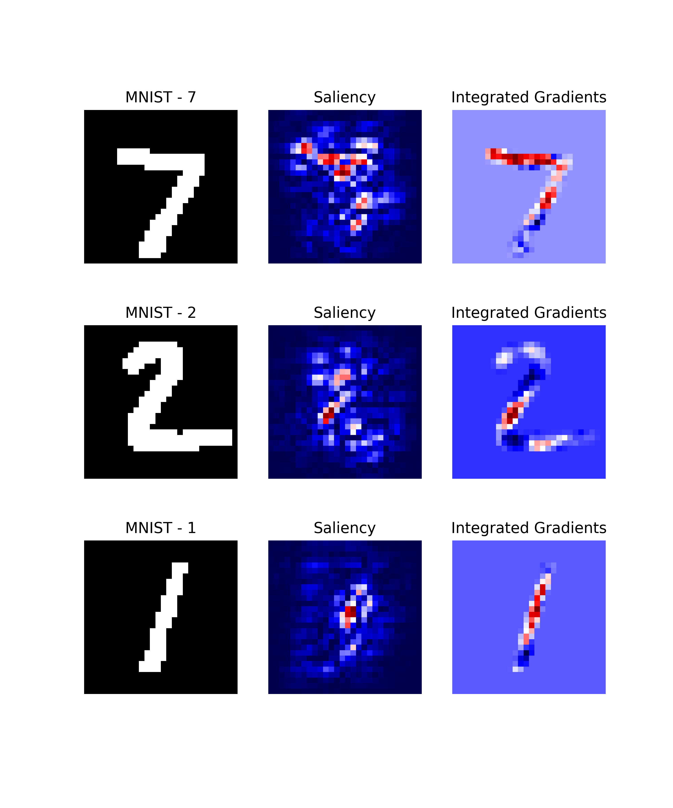

<p align="center">
  
</p>
<!--<h1 align="center"><b>Quantus</b></h1>-->
<h3 align="center"><b>A toolkit to evaluate neural network explanations</b></h3>
<p align="center">
  PyTorch and TensorFlow

[](https://colab.research.google.com/github/understandable-machine-intelligence-lab/Quantus/blob/main/tutorials/Tutorial_ImageNet_Example_All_Metrics.ipynb)
[](https://mybinder.org/v2/gh/understandable-machine-intelligence-lab/Quantus/HEAD?labpath=tutorials)
[](https://github.com/understandable-machine-intelligence-lab/Quantus/actions/workflows/python-package.yml)
[](https://github.com/understandable-machine-intelligence-lab/Quantus/actions/workflows/codecov.yml)

[](https://badge.fury.io/py/quantus)
[](https://github.com/psf/black)
[](https://quantus.readthedocs.io/en/latest/?badge=latest)
[](https://codecov.io/github/understandable-machine-intelligence-lab/Quantus?branch=master)

_Quantus is currently under active development so carefully note the Quantus release version to ensure reproducibility of your work._

[📑 Shortcut to paper!](https://jmlr.org/papers/volume24/22-0142/22-0142.pdf)
        
## News and Highlights! :rocket:

- Accepted to Journal of Machine Learning Research (MLOSS)! Read more [here](https://jmlr.org/papers/v24/22-0142.html).
- Please see our [latest release](https://github.com/understandable-machine-intelligence-lab/Quantus/releases) which minor version includes some [heavy API changes](https://github.com/understandable-machine-intelligence-lab/Quantus/releases/tag/v0.2.0)!
- Offers more than **30+ metrics in 6 categories** for XAI evaluation 
- Supports different data types (image, time-series, tabular, NLP next up!) and models (PyTorch and TensorFlow)
- Extended built-in support for explanation methods ([captum](https://captum.ai/) and [tf-explain](https://tf-explain.readthedocs.io/en/latest/))
- Latest metrics additions:
    - <b>Consistency </b><a href="https://arxiv.org/abs/2202.00734">(Dasgupta et al., 2022)</a>
    - <b>Sufficiency </b><a href="https://arxiv.org/abs/2202.00734">(Dasgupta et al., 2022)</a>
    - <b>Relative Input Stability</b><a href="https://arxiv.org/pdf/2203.06877.pdf"> (Chirag Agarwal, et. al., 2022)</a>
    - <b>Relative Output Stability</b><a href="https://arxiv.org/pdf/2203.06877.pdf"> (Chirag Agarwal, et. al., 2022)</a>
    - <b>Relative Representation Stability</b><a href="https://arxiv.org/pdf/2203.06877.pdf"> (Chirag Agarwal, et. al., 2022)</a>
- New optimisations to help speed up computation, see API reference [here](https://quantus.readthedocs.io/en/latest/docs_api/quantus.metrics.base_batched.html)!

## Citation

If you find this toolkit or its companion paper
[**Quantus: An Explainable AI Toolkit for Responsible Evaluation of Neural Network Explanations and Beyond**](https://jmlr.org/papers/v24/22-0142.html)
interesting or useful in your research, use the following Bibtex annotation to cite us:

```bibtex
@article{hedstrom2023quantus,
  author  = {Anna Hedstr{\"{o}}m and Leander Weber and Daniel Krakowczyk and Dilyara Bareeva and Franz Motzkus and Wojciech Samek and Sebastian Lapuschkin and Marina Marina M.{-}C. H{\"{o}}hne},
  title   = {Quantus: An Explainable AI Toolkit for Responsible Evaluation of Neural Network Explanations and Beyond},
  journal = {Journal of Machine Learning Research},
  year    = {2023},
  volume  = {24},
  number  = {34},
  pages   = {1--11},
  url     = {http://jmlr.org/papers/v24/22-0142.html}
}


```

When applying the individual metrics of Quantus, please make sure to also properly cite the work of the original authors (as linked above).

## Table of contents

* [Library overview](#library-overview)
* [Installation](#installation)
* [Getting started](#getting-started)
* [Tutorials](#tutorials)
* [Contributing](#contributing)
<!--* [Citation](#citation)-->

## Library overview 

A simple visual comparison of eXplainable Artificial Intelligence (XAI) methods is often not sufficient to decide which explanation method works best as shown exemplarily in Figure a) for four gradient-based methods — Saliency ([Mørch et al., 1995](https://ieeexplore.ieee.org/document/488997); [Baehrens et al., 2010](https://www.jmlr.org/papers/volume11/baehrens10a/baehrens10a.pdf)), Integrated Gradients ([Sundararajan et al., 2017](http://proceedings.mlr.press/v70/sundararajan17a/sundararajan17a.pdf)), GradientShap ([Lundberg and Lee, 2017](https://arxiv.org/abs/1705.07874)) or FusionGrad ([Bykov et al., 2021](https://arxiv.org/abs/2106.10185)), yet it is a common practice for evaluation XAI methods in absence of ground truth data. Therefore, we developed Quantus, an easy-to-use yet comprehensive toolbox for quantitative evaluation of explanations — including 30+ different metrics. 

</p>
<p align="center">
  
</p>

With Quantus, we can obtain richer insights on how the methods compare e.g., b) by holistic quantification on several evaluation criteria and c) by providing sensitivity analysis of how a single parameter e.g. the pixel replacement strategy of a faithfulness test influences the ranking of the XAI methods.
 
### Metrics

This project started with the goal of collecting existing evaluation metrics that have been introduced in the context of XAI research — to help automate the task of _XAI quantification_. Along the way of implementation, it became clear that XAI metrics most often belong to one out of six categories i.e., 1) faithfulness, 2) robustness, 3) localisation 4) complexity 5) randomisation or 6) axiomatic metrics. The library contains implementations of the following evaluation metrics:

<details>
  <summary><b>Faithfulness</b></summary>
quantifies to what extent explanations follow the predictive behaviour of the model (asserting that more important features play a larger role in model outcomes)
 <br><br>
  <ul>
    <li><b>Faithfulness Correlation </b><a href="https://www.ijcai.org/Proceedings/2020/0417.pdf">(Bhatt et al., 2020)</a>: iteratively replaces a random subset of given attributions with a baseline value and then measuring the correlation between the sum of this attribution subset and the difference in function output 
    <li><b>Faithfulness Estimate </b><a href="https://arxiv.org/pdf/1806.07538.pdf">(Alvarez-Melis et al., 2018)</a>: computes the correlation between probability drops and attribution scores on various points
    <li><b>Monotonicity Metric </b><a href="https://arxiv.org/abs/1909.03012">(Arya et al. 2019)</a>: starts from a reference baseline to then incrementally replace each feature in a sorted attribution vector, measuring the effect on model performance
    <li><b>Monotonicity Metric </b><a href="https://arxiv.org/pdf/2007.07584.pdf"> (Nguyen et al, 2020)</a>: measures the spearman rank correlation between the absolute values of the attribution and the uncertainty in the probability estimation
    <li><b>Pixel Flipping </b><a href="https://journals.plos.org/plosone/article?id=10.1371/journal.pone.0130140">(Bach et al., 2015)</a>: captures the impact of perturbing pixels in descending order according to the attributed value on the classification score
    <li><b>Region Perturbation </b><a href="https://arxiv.org/pdf/1509.06321.pdf">(Samek et al., 2015)</a>: is an extension of Pixel-Flipping to flip an area rather than a single pixel
    <li><b>Selectivity </b><a href="https://arxiv.org/pdf/1706.07979.pdf">(Montavon et al., 2018)</a>: measures how quickly an evaluated prediction function starts to drop when removing features with the highest attributed values
    <li><b>SensitivityN </b><a href="https://arxiv.org/pdf/1711.06104.pdf">(Ancona et al., 2019)</a>: computes the correlation between the sum of the attributions and the variation in the target output while varying the fraction of the total number of features, averaged over several test samples
    <li><b>IROF </b><a href="https://arxiv.org/pdf/2003.08747.pdf">(Rieger at el., 2020)</a>: computes the area over the curve per class for sorted mean importances of feature segments (superpixels) as they are iteratively removed (and prediction scores are collected), averaged over several test samples
    <li><b>Infidelity </b><a href="https://arxiv.org/pdf/1901.09392.pdf">(Chih-Kuan, Yeh, et al., 2019)</a>: represents the expected mean square error between 1) a dot product of an attribution and input perturbation and 2) difference in model output after significant perturbation 
    <li><b>ROAD </b><a href="https://arxiv.org/pdf/2202.00449.pdf">(Rong, Leemann, et al., 2022)</a>: measures the accuracy of the model on the test set in an iterative process of removing k most important pixels, at each step k most relevant pixels (MoRF order) are replaced with noisy linear imputations
    <li><b>Sufficiency </b><a href="https://arxiv.org/abs/2202.00734">(Dasgupta et al., 2022)</a>: measures the extent to which similar explanations have the same prediction label
</ul>
</details>

<details>
<summary><b>Robustness</b></summary>
measures to what extent explanations are stable when subject to slight perturbations of the input, assuming that model output approximately stayed the same
     <br><br>
<ul>
    <li><b>Local Lipschitz Estimate </b><a href="https://arxiv.org/pdf/1806.08049.pdf">(Alvarez-Melis et al., 2018)</a>: tests the consistency in the explanation between adjacent examples
    <li><b>Max-Sensitivity </b><a href="https://arxiv.org/pdf/1901.09392.pdf">(Yeh et al., 2019)</a>: measures the maximum sensitivity of an explanation using a Monte Carlo sampling-based approximation
    <li><b>Avg-Sensitivity </b><a href="https://arxiv.org/pdf/1901.09392.pdf">(Yeh et al., 2019)</a>: measures the average sensitivity of an explanation using a Monte Carlo sampling-based approximation
    <li><b>Continuity </b><a href="https://arxiv.org/pdf/1706.07979.pdf">(Montavon et al., 2018)</a>: captures the strongest variation in explanation of an input and its perturbed version
    <li><b>Consistency </b><a href="https://arxiv.org/abs/2202.00734">(Dasgupta et al., 2022)</a>: measures the probability that the inputs with the same explanation have the same prediction label
    <li><b>Relative Input Stability (RIS)</b><a href="https://arxiv.org/pdf/2203.06877.pdf"> (Chirag Agarwal, et. al., 2022)</a>: measures the relative distance between explanations e_x and e_x' with respect to the distance between the two inputs x and x'
    <li><b>Relative Representation Stability (RRS)</b><a href="https://arxiv.org/pdf/2203.06877.pdf"> (Chirag Agarwal, et. al., 2022)</a>: measures the relative distance between explanations e_x and e_x' with respect to the distance between internal models representations L_x and L_x' for x and x' respectively
    <li><b>Relative Output Stability (ROS)</b><a href="https://arxiv.org/pdf/2203.06877.pdf"> (Chirag Agarwal, et. al., 2022)</a>: measures the relative distance between explanations e_x and e_x' with respect to the distance between output logits h(x) and h(x') for x and x' respectively
</ul>
</details>

<details>
<summary><b>Localisation</b></summary>
tests if the explainable evidence is centred around a region of interest (RoI) which may be defined around an object by a bounding box, a segmentation mask or, a cell within a grid
     <br><br>
<ul>
    <li><b>Pointing Game </b><a href="https://arxiv.org/abs/1608.00507">(Zhang et al., 2018)</a>: checks whether attribution with the highest score is located within the targeted object
    <li><b>Attribution Localization </b><a href="https://arxiv.org/abs/1910.09840">(Kohlbrenner et al., 2020)</a>: measures the ratio of positive attributions within the targeted object towards the total positive attributions
    <li><b>Top-K Intersection </b><a href="https://arxiv.org/abs/2104.14995">(Theiner et al., 2021)</a>: computes the intersection between a ground truth mask and the binarized explanation at the top k feature locations
    <li><b>Relevance Rank Accuracy </b><a href="https://arxiv.org/abs/2003.07258">(Arras et al., 2021)</a>: measures the ratio of highly attributed pixels within a ground-truth mask towards the size of the ground truth mask
    <li><b>Relevance Mass Accuracy </b><a href="https://arxiv.org/abs/2003.07258">(Arras et al., 2021)</a>: measures the ratio of positively attributed attributions inside the ground-truth mask towards the overall positive attributions
    <li><b>AUC </b><a href="https://doi.org/10.1016/j.patrec.2005.10.010">(Fawcett et al., 2006)</a>: compares the ranking between attributions and a given ground-truth mask
    <li><b>Focus </b><a href="https://arxiv.org/abs/2109.15035">(Arias et al., 2022)</a>: quantifies the precision of the explanation by creating mosaics of data instances from different classes
</ul>
</details>

<details>
<summary><b>Complexity</b></summary>
captures to what extent explanations are concise i.e., that few features are used to explain a model prediction
     <br><br>
<ul>
    <li><b>Sparseness </b><a href="https://arxiv.org/abs/1810.06583">(Chalasani et al., 2020)</a>: uses the Gini Index for measuring, if only highly attributed features are truly predictive of the model output
    <li><b>Complexity </b><a href="https://arxiv.org/abs/2005.00631">(Bhatt et al., 2020)</a>: computes the entropy of the fractional contribution of all features to the total magnitude of the attribution individually
    <li><b>Effective Complexity </b><a href="https://arxiv.org/abs/2007.07584">(Nguyen at el., 2020)</a>: measures how many attributions in absolute values are exceeding a certain threshold
</ul>
</details>

<details>
<summary><b>Randomisation</b></summary>
tests to what extent explanations deteriorate as inputs to the evaluation problem e.g., model parameters are increasingly randomised
     <br><br>
<ul>
    <li><b>Model Parameter Randomisation </b><a href="https://arxiv.org/abs/1810.03292">(Adebayo et. al., 2018)</a>: randomises the parameters of single model layers in a cascading or independent way and measures the distance of the respective explanation to the original explanation
    <li><b>Random Logit Test </b><a href="https://arxiv.org/abs/1912.09818">(Sixt et al., 2020)</a>: computes for the distance between the original explanation and the explanation for a random other class
</ul>
</details>

<details>
<summary><b>Axiomatic</b></summary>
  assesses if explanations fulfil certain axiomatic properties
     <br><br>
<ul>
    <li><b>Completeness </b><a href="https://arxiv.org/abs/1703.01365">(Sundararajan et al., 2017)</a>: evaluates whether the sum of attributions is equal to the difference between the function values at the input x and baseline x' (and referred to as Summation to Delta (Shrikumar et al., 2017), Sensitivity-n (slight variation, Ancona et al., 2018) and Conservation (Montavon et al., 2018))
    <li><b>Non-Sensitivity </b><a href="https://arxiv.org/abs/2007.07584">(Nguyen at el., 2020)</a>: measures whether the total attribution is proportional to the explainable evidence at the model output
    <li><b>Input Invariance </b><a href="https://arxiv.org/abs/1711.00867">(Kindermans et al., 2017)</a>: adds a shift to input, asking that attributions should not change in response (assuming the model does not)
</ul>
</details>

Additional metrics will be included in future releases. Please [open an issue](https://github.com/understandable-machine-intelligence-lab/Quantus/issues/new/choose) if you have a metric you believe should be apart of Quantus.

**Disclaimers.** It is worth noting that the implementations of the metrics in this library have not been verified by the original authors. Thus any metric implementation in this library may differ from the original authors. Further, bear in mind that evaluation metrics for XAI methods are often empirical interpretations (or translations) of qualities that some researcher(s) claimed were important for explanations to fulfil, so it may be a discrepancy between what the author claims to measure by the proposed metric and what is actually measured e.g., using entropy as an operationalisation of explanation complexity. Please read the [user guidelines](https://quantus.readthedocs.io/en/latest/guidelines/guidelines_and_disclaimers.html) for further guidance on how to best use the library. 

## Installation

If you already have [PyTorch](https://pytorch.org/) or [TensorFlow](https://www.TensorFlow.org) installed on your machine, 
the most light-weight version of Quantus can be obtained from [PyPI](https://pypi.org/project/quantus/) as follows (no additional explainability functionality or deep learning framework will be included):

```setup
pip install quantus
```
Alternatively, you can simply add the desired deep learning framework (in brackets) to have the package installed together with Quantus.
To install Quantus with PyTorch, please run:
```setup
pip install "quantus[torch]"
```

For TensorFlow, please run:

```setup
pip install "quantus[tensorflow]"
```

Alternatively, you can simply install Quantus with [requirements.txt](https://github.com/understandable-machine-intelligence-lab/Quantus/blob/main/requirements.txt).
Note that this installation requires that either [PyTorch](https://pytorch.org/) or [TensorFlow](https://www.TensorFlow.org) are already installed on your machine.

```setup
pip install -r requirements.txt
```

For a more in-depth guide on how to install Quantus, please read more [here](https://quantus.readthedocs.io/en/latest/getting_started/installation.html). This includes instructions for how to install a desired deep learning framework such as PyTorch or TensorFlow together with Quantus.

### Package requirements

The package requirements are as follows:
```
python>=3.7.0
pytorch>=1.10.1
TensorFlow==2.6.2
```

## Getting started

The following will give a short introduction to how to get started with Quantus. Note that this example is based on the [PyTorch](https://pytorch.org/) framework, but we also support 
[TensorFlow](https://www.tensorflow.org), which would differ only in the loading of the model, data and explanations. To get started with Quantus, you need:
* A model (`model`), inputs (`x_batch`) and labels (`y_batch`)
* Some explanations you want to evaluate (`a_batch`)


<details>
<summary><b><big>Step 1. Load data and model</big></b></summary>

Let's first load the data and model. In this example, a pre-trained LeNet available from Quantus 
for the purpose of this tutorial is loaded, but generally, you might use any Pytorch (or TensorFlow) model instead. To follow this example, one needs to have quantus and torch installed, by e.g., `pip install 'quantus[torch]'`.

```python
import quantus
from quantus.helpers.model.models import LeNet
import torch
import torchvision
from torchvision import transforms
  
# Enable GPU.
device = torch.device("cuda:0" if torch.cuda.is_available() else "cpu")

# Load a pre-trained LeNet classification model (architecture at quantus/helpers/models).
model = LeNet()
if device.type == "cpu":
    model.load_state_dict(torch.load("tests/assets/mnist", map_location=torch.device('cpu')))
else: 
    model.load_state_dict(torch.load("tests/assets/mnist"))

# Load datasets and make loaders.
test_set = torchvision.datasets.MNIST(root='./sample_data', download=True, transforms=transforms.Compose([transforms.ToTensor()]))
test_loader = torch.utils.data.DataLoader(test_set, batch_size=24)

# Load a batch of inputs and outputs to use for XAI evaluation.
x_batch, y_batch = iter(test_loader).next()
x_batch, y_batch = x_batch.cpu().numpy(), y_batch.cpu().numpy()
```
</details>

<details>
<summary><b><big>Step 2. Load explanations</big></b></summary>

We still need some explanations to evaluate. 
For this, there are two possibilities in Quantus. You can provide either:
1. a set of re-computed attributions (`np.ndarray`)
2. any arbitrary explanation function (`callable`), e.g., the built-in method `quantus.explain` or your own customised function

We show the different options below.

#### Using pre-computed explanations

Quantus allows you to evaluate explanations that you have pre-computed, 
assuming that they match the data you provide in `x_batch`. Let's say you have explanations 
for [Saliency](https://arxiv.org/abs/1312.6034) and [Integrated Gradients](https://arxiv.org/abs/1703.01365)
already pre-computed.

In that case, you can simply load these into corresponding variables `a_batch_saliency` 
and `a_batch_intgrad`:

```python
a_batch_saliency = load("path/to/precomputed/saliency/explanations")
a_batch_saliency = load("path/to/precomputed/intgrad/explanations")
```

Another option is to simply obtain the attributions using one of many XAI frameworks out there, 
such as [Captum](https://captum.ai/), 
[Zennit](https://github.com/chr5tphr/zennit), 
[tf.explain](https://github.com/sicara/tf-explain),
or [iNNvestigate](https://github.com/albermax/innvestigate). The following code example shows how to obtain explanations ([Saliency](https://arxiv.org/abs/1312.6034) 
and [Integrated Gradients](https://arxiv.org/abs/1703.01365), to be specific) 
using [Captum](https://captum.ai/):

```python
import captum
from captum.attr import Saliency, IntegratedGradients

# Generate Integrated Gradients attributions of the first batch of the test set.
a_batch_saliency = Saliency(model).attribute(inputs=x_batch, target=y_batch, abs=True).sum(axis=1).cpu().numpy()
a_batch_intgrad = IntegratedGradients(model).attribute(inputs=x_batch, target=y_batch, baselines=torch.zeros_like(x_batch)).sum(axis=1).cpu().numpy()

# Save x_batch and y_batch as numpy arrays that will be used to call metric instances.
x_batch, y_batch = x_batch.cpu().numpy(), y_batch.cpu().numpy()

# Quick assert.
assert [isinstance(obj, np.ndarray) for obj in [x_batch, y_batch, a_batch_saliency, a_batch_intgrad]]
```

#### Passing an explanation function

If you don't have a pre-computed set of explanations but rather want to pass an arbitrary explanation function 
that you wish to evaluate with Quantus, this option exists. 

For this, you can for example rely on the built-in `quantus.explain` function to get started, which includes some popular explanation methods 
(please run `quantus.available_methods()` to see which ones).  Examples of how to use `quantus.explain` 
or your own customised explanation function are included in the next section.



As seen in the above image, the qualitative aspects of explanations 
may look fairly uninterpretable --- since we lack ground truth of what the explanations
should be looking like, it is hard to draw conclusions about the explainable evidence. To gather quantitative evidence for the quality of the different explanation methods, we can apply Quantus.
</details>

<details>
<summary><b><big>Step 3. Evaluate with Quantus</big></b></summary> 

Quantus implements XAI evaluation metrics from different categories, 
e.g., Faithfulness, Localisation and Robustness etc which all inherit from the base `quantus.Metric` class. 
To apply a metric to your setting (e.g., [Max-Sensitivity](https://arxiv.org/abs/1901.09392)) 
it first needs to be instantiated:

```python
metric = quantus.MaxSensitivity(nr_samples=10,
                                lower_bound=0.2,
                                norm_numerator=quantus.fro_norm,
                                norm_denominator=quantus.fro_norm,
                                perturb_func=quantus.uniform_noise,
                                similarity_func=quantus.difference)
```

and then applied to your model, data, and (pre-computed) explanations:

```python
scores = metric(
    model=model,
    x_batch=x_batch,
    y_batch=y_batch,
    a_batch=a_batch_saliency,
    device=device
)
```

#### Use quantus.explain

Alternatively, instead of providing pre-computed explanations, you can employ the `quantus.explain` function,
which can be specified through a dictionary passed to `explain_func_kwargs`.

```python
scores = metric(
    model=model,
    x_batch=x_batch,
    y_batch=y_batch,
    device=device,
    explain_func=quantus.explain,
    explain_func_kwargs={"method": "Saliency"}
)
```

#### Employ customised functions

You can alternatively use your own customised explanation function
(assuming it returns an `np.ndarray` in a shape that matches the input `x_batch`). This is done as follows:

```python
def your_own_callable(model, models, targets, **kwargs) -> np.ndarray
  """Logic goes here to compute the attributions and return an 
  explanation  in the same shape as x_batch (np.array), 
  (flatten channels if necessary)."""
  return explanation(model, x_batch, y_batch)

scores = metric(
    model=model,
    x_batch=x_batch,
    y_batch=y_batch,
    device=device,
    explain_func=your_own_callable
)
```
#### Run large-scale evaluation

Quantus also provides high-level functionality to support large-scale evaluations,
e.g., multiple XAI methods, multifaceted evaluation through several metrics, or a combination thereof. To utilise `quantus.evaluate()`, you simply need to define two things:

1. The **Metrics** you would like to use for evaluation (each `__init__` parameter configuration counts as its own metric):
    ```python
    metrics = {
        "max-sensitivity-10": quantus.MaxSensitivity(nr_samples=10),
        "max-sensitivity-20": quantus.MaxSensitivity(nr_samples=20),
        "region-perturbation": quantus.RegionPerturbation(),
    }
    ```
   
2. The **XAI methods** you would like to evaluate, e.g., a `dict` with pre-computed attributions:
    ```python
    xai_methods = {
        "Saliency": a_batch_saliency,
        "IntegratedGradients": a_batch_intgrad
    }
    ```

You can then simply run a large-scale evaluation as follows (this aggregates the result by `np.mean` averaging):

```python
import numpy as np
results = quantus.evaluate(
      metrics=metrics,
      xai_methods=xai_methods,
      agg_func=np.mean,
      model=model,
      x_batch=x_batch,
      y_batch=y_batch,
      **{"softmax": False,}
)
```
</details>

Please see [
Getting started tutorial](https://github.com/understandable-machine-intelligence-lab/quantus/blob/main/tutorials/Tutorial_Getting_Started.ipynb) to run code similar to this example. For more information on how to customise metrics and extend Quantus' functionality, please see [Getting started guide](https://quantus.readthedocs.io/en/latest/getting_started/getting_started_example.html).


## Tutorials

Further tutorials are available that showcase the many types of analysis that can be done using Quantus.
For this purpose, please see notebooks in the [tutorials](https://github.com/understandable-machine-intelligence-lab/Quantus/blob/main/tutorials/) folder which includes examples such as:
* [All Metrics ImageNet Example](https://github.com/understandable-machine-intelligence-lab/Quantus/blob/main/tutorials/Tutorial_ImageNet_Example_All_Metrics.ipynb): shows how to instantiate the different metrics for ImageNet dataset
* [Metric Parameterisation Analysis](https://github.com/understandable-machine-intelligence-lab/Quantus/blob/main/tutorials/Tutorial_Metric_Parameterisation_Analysis.ipynb): explores how sensitive a metric could be to its hyperparameters
* [Robustness Analysis Model Training](https://github.com/understandable-machine-intelligence-lab/Quantus/blob/main/tutorials/Tutorial_XAI_Sensitivity_Model_Training.ipynb): measures robustness of explanations as model accuracy increases 
* [Full Quantification with Quantus](https://github.com/understandable-machine-intelligence-lab/Quantus/blob/main/tutorials/Tutorial_ImageNet_Quantification_with_Quantus.ipynb): example of benchmarking explanation methods
* [Tabular Data Example](https://github.com/understandable-machine-intelligence-lab/Quantus/blob/main/tutorials/Tutorial_Getting_Started_with_Tabular_Data.ipynb): example of how to use Quantus with tabular data
* [Quantus and TensorFlow Data Example](https://github.com/understandable-machine-intelligence-lab/Quantus/blob/main/tutorials/Tutorial_Getting_Started_with_Tensorflow.ipynb): showcases how to use Quantus with TensorFlow

... and more.

## Contributing

We welcome any sort of contribution to Quantus! For a detailed contribution guide, please refer to [Contributing](https://github.com/understandable-machine-intelligence-lab/Quantus/blob/main/CONTRIBUTING.md) documentation first. 

If you have any developer-related questions, please [open an issue](https://github.com/understandable-machine-intelligence-lab/Quantus/issues/new/choose)
or write us at [hedstroem.anna@gmail.com](mailto:hedstroem.anna@gmail.com).
