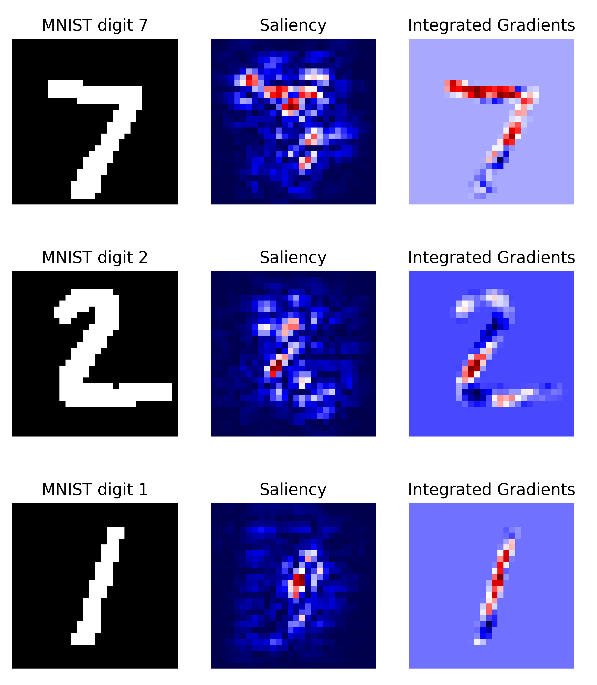

<p align="center">
  
</p>
<!--<h1 align="center"><b>Quantus</b></h1>-->
<h3 align="center"><b> A toolbox for quantitative evaluation of XAI</b></h3>
<p align="center">
  PyTorch <i>and</i> Tensorflow
</p>

[](https://github.com/understandable-machine-intelligence-lab/Quantus/actions/workflows/python-package.yml)
[](https://github.com/understandable-machine-intelligence-lab/Quantus/actions/workflows/codecov.yml)

[](https://badge.fury.io/py/quantus)
<!--[](https://docs.seldon.io/projects/qyabtys/en/latest/?badge=latest)-->
<!--[GitHub Licence](https://img.quantus.io/github/license/understandable-machine-intelligence-lab/Quantus.svg)-->
<!--[](https://join.slack.com/t/seldondev/shared_invite/zt-vejg6ttd-ksZiQs3O_HOtPQsen_labg)-->

_Quantus is currently under active development and has not yet reached a stable state!
Interfaces may change suddenly and without warning, so please be careful when attempting to use Quantus in its current state._

## Table of contents

* [Library content](#library-content)
* [Installation](##installation)
* [Getting Started](#getting-started)
* [Tutorials](#tutorials)
* [Misc functionality](#misc-functionality)
* [Contributing](#contributing)

<!--### Citation

If you find this library helpful in speeding up your research please cite using the following Bibtex annotation:

@misc{quantus,
      title={Quantus: Github repository},
      author={Anna Hedström, Leander Weber, Wojciech Samek, Sebastian Lapuschkin, Marina Höhne},
      year={2021},
      eprint={2106.10185},
      archivePrefix={arXiv},
      primaryClass={cs.LG}}
-->

## Library overview 

Simple _qualitative_ comparison of XAI methods is often not sufficient to decide which explanation method works best as shown exemplary in Figure a) for four gradient-based methods — Saliency (Shrikumar et al., 2017), Integrated Gradients (Sundararajan et al., 2017), GradientShap (Lundberg and Lee, 2017) or FusionGrad (Bykov et al., 2021).
Therefore, we developed Quantus, an easy to-use yet comprehensive toolbox for quantitative evaluation of explanations — including 25+ different metrics. 
With Quantus, we can obtain richer insights on how the methods compare e.g., b) by holistic quantification on several evaluation criteria and c) by providing sensitivity analysis of how a single parameter e.g. the pixel replacement strategy of a faithfulness test influences the ranking of the XAI methods.

</p>
<p align="center">
  
</p>

 
**Implementations.** This project started with the goal of collecting existing evaluation metrics that have been introduced in the context of Explainable Artificial Intelligence (XAI) research. Along the way of implementation, it became clear that XAI metrics most often belong to one out of six categories i.e., 1) faithfulness, 2) robustness, 3) localisation 4) complexity 5) randomisation or 6) axiomatic metrics. It is important to note here that in XAI literature, the categories are often mentioned under different naming conventions e.g., 'robustness' is often replaced for 'stability' or 'sensitivity' and "'faithfulness' is commonly interchanged for 'fidelity'). The library contains implementations of the following evaluation metrics:

<details>
<summary>Faithfulness</summary>
quantifies to what extent explanations follow the predictive behaviour of the model (asserting that more important features play a larger role in model outcomes)
<ul>
<li><a href="https://www.ijcai.org/Proceedings/2020/0417.pdf">Faithfulness Correlation</a>: iteratively replaces a random subset of given attributions with a baseline value and then measuring the correlation between the sum of this attribution subset and the difference in function output 
<li><a href="https://arxiv.org/pdf/1806.07538.pdf">Faithfulness Estimate</a>: computes the correlation between probability drops and attribution scores on various points
<li><a href="https://arxiv.org/abs/1909.03012">Monotonicity Metric Arya</a>: starts from a reference baseline to then incrementally replace each feature in a sorted attribution vector, measuing the effect on model performance
<li><a href="https://arxiv.org/pdf/2007.07584.pdf">Monotonicity Metric Nguyen</a>: measures the spearman rank correlation between the absolute values of the attribution and the uncertainty in the probability estimation
<li><a href="https://journals.plos.org/plosone/article?id=10.1371/journal.pone.0130140">Pixel Flipping</a>: aptures the impact of perturbing pixels in descending order according to the attributed value on the classification score
<li><a href="https://arxiv.org/pdf/1509.06321.pdf">Region Perturbation</a>: is an extension of Pixel-Flipping to flip an area rather than a single pixel
<li><a href="https://arxiv.org/pdf/1706.07979.pdf">Selectivity</a>: measures how quickly an evaluated prediction function starts to drop when removing features with the highest attributed values
<li><a href="https://arxiv.org/pdf/1711.06104.pdf">SensitivityN</a>: computes the correlation between the sum of the attributions and the variation in the target output while varying the fraction of the total number of features, averaged over several test samples
<li><a href="https://arxiv.org/pdf/2003.08747.pdf">IROF</a>: computes the area over the curve per class for sorted mean importances of feature segments (superpixels) as they are iteratively removed (and prediction scores are collected), averaged over several test samples
</ul>
</details>

<details>
<summary>Robustness</summary>
measures to what extent explanations are stable when subject to slight perturbations of the input, assuming that model output approximately stayed the same
<ul>
<li><a href="https://arxiv.org/pdf/1806.08049.pdf">Local Lipschitz Estimate</a>: tests the consistency in the explanation between adjacent examples
<li><a href="https://arxiv.org/pdf/1901.09392.pdf">Max-Sensitivity</a>: measures the maximum sensitivity of an explanation using a Monte Carlo sampling-based approximation
<li><a href="https://arxiv.org/pdf/1901.09392.pdf">Avg-Sensitivity</a>: measures the average sensitivity of an explanation using a Monte Carlo sampling-based approximation
<li><a href="https://arxiv.org/pdf/1706.07979.pdf">Continuity</a>: captures the strongest variation in explanation of an input and it's perturbed version
</ul>
</details>

<details>
<summary>Localisation</summary>
tests if the explainable evidence is centered around the object of interest (as defined by a bounding box or similar segmentation mask)
<ul>
<li><a href="https://arxiv.org/abs/1608.00507">Pointing Game</a>: checks whether attribution with the highest score is located within the targeted object
<li><a href="https://arxiv.org/abs/1910.09840">Attribution Localization</a>: measures the ratio of positive attributions within the targeted object towards the total positive attributions
<li><a href="https://arxiv.org/abs/2104.14995">Top-K Intersection</a>: computes the intersection between a ground truth mask and the binarized explanation at the top k feature locations
<li><a href="https://arxiv.org/abs/2003.07258">Relevance Rank Accuracy</a>: measures the ratio of highly attributed pixels within a ground-truth mask towards the size of the ground truth mask
<li><a href="https://arxiv.org/abs/2003.07258">Relevance Mass Accuracy</a>: measures the ratio of positively attributed attributions inside the ground-truth mask towards the overall positive attributions
<li><a href="https://doi.org/10.1016/j.patrec.2005.10.010">AUC</a>: compares the ranking between attributions and a given ground-truth mask
</ul>
</details>

<details>
<summary>Complexity</summary>
captures to what extent explanations are concise i.e., that few features are used to explain a model prediction
<ul>
<li><a href="https://arxiv.org/abs/1810.06583">Sparseness</a>: uses the Gini Index for measuring, if only highly attributed features are truly predictive of the model output
<li><a href="https://arxiv.org/abs/2005.00631">Complexity</a>: computes the entropy of the fractional contribution of all features to the total magnitude of the attribution individually
<li><a href="https://arxiv.org/abs/2007.07584">Effective Complexity</a>: measures how many attributions in absolute values are exceeding a certain threshold
</ul>
</details>

<details>
<summary>Randomisation</summary>
tests to what extent explanations deteriorate as model parameters are increasingly randomised
<ul>
<li><a href="https://arxiv.org/abs/1810.03292">Model Parameter Randomisation</a>: randomises the parameters of single model layers in a cascading or independent way and measures the distance of the respective explanation to the original explanation
<li><a href="https://arxiv.org/abs/1912.09818">andom Logit Test</a>: computes for the distance between the original explanation and the explanation for a random other class
</ul>
</details>

<details>
<summary>Axiomatic</summary>
<ul>
<li><a href="https://arxiv.org/abs/1703.01365">Completeness</a>: assesses if explanations fulfill certain axiomatic properties
<li><a href="https://arxiv.org/abs/2007.07584">Non-Sensitivity</a>: measures whether the total attribution is proportional to the explainable evidence at the model output  (and referred to as Summation to Delta (Shrikumar et al., 2017) Sensitivity-n (slight variation, Ancona et al., 2018) Conservation (Montavon et al., 2018))
<li><a href="https://arxiv.org/abs/1711.00867">Input Invariance</a>: adds a shift to input, asking that attributions should not change in response (assuming the model does not)
</ul>
</details>

Additional metrics will be included in future releases.

**Scope.** There is a couple of metrics that are popular but have not been included in the first version of this library.
Metrics that require re-training of the network e.g., RoAR (Hooker et al., 2018) and Label Randomisation Test (Adebayo et al.,  2018) or rely on specifically designed datasets/ dataset modification e.g., Model Contrast Scores and Input Dependence Rate (Yang et al., 2019) and Attribution Percentage (Attr%) (Zhou et al., 2021) are considered out of scope of the first iteration.

**Motivation.** It is worth nothing that this implementation primarily is motivated by image classification tasks. Further, it has been developed with attribution-based explanations in mind (which is a category of explanation methods that aim to assign an importance value to the model features and arguably, is the most studied kind of explanation). As a result, there will be both applications and explanation methods e.g., example-based methods where this library won't be applicable.

**Disclaimers.** Note that the implementations of metrics in this library have not been verified by the original authors. Thus any metric implementation in this library may differ from the original authors. Also, metrics for XAI methods are often empirical interpretations (or translations) of qualities that some researcher(s) claimed were important for explanations to fulfill. Hence it may be a discrepancy between what the author claims to measure by the proposed metric and what is actually measured e.g., using entropy as an operationalisation of explanation complexity. Please read the user guidelines for further guidance on how to best use the library.

## Installation


Quantus can be installed from [PyPI](https://pypi.org/project/quantus/0.1.0/) 
(this way assumes that you have either `torch` or `tensorflow` already installed on your machine).  

```setup
pip install quantus
```

If you don't have `torch` or `tensorflow` installed, you can simply add the package you want and install it simultaneously.

```setup
pip install quantus[torch]
```
Or, alternatively for `tensorflow` you run:

```setup
pip install quantus[tensorflow]
```

Additionally, if you want to use the basic explainability functionaliy such as `quantus.explain` in your evaluations, you can run `pip install quantus[extras]` (this step requires that either `torch` or `tensorflow` is installed).

Alternatively, simply install requirements.txt (again, this requires that either `torch` or `tensorflow` is installed and won't include the explainability functionality to the installation):

```setup
pip install -r requirements.txt
```

### Package requirements:

```
python>=3.7.0
pytorch>=1.10.1
tensorflow==2.6.2; python==3.7.0
tensorflow>=2.6.2; python>=3.7.0
```

## Getting started

To use the library, you'll need a couple of ingredients; a torch model, some input data and labels (to be explained).

```python
import quantus
import torch
import torchvision

# Load a pre-trained LeNet classification model (architecture at quantus/helpers/models).
model = LeNet()
model.load_state_dict(torch.load("tutorials/assets/mnist"))

# Load datasets and make loaders.
test_set = torchvision.datasets.MNIST(root='./sample_data', download=True)
test_loader = torch.utils.data.DataLoader(test_set, batch_size=24)

# Load a batch of inputs and outputs to use for XAI evaluation.
x_batch, y_batch = iter(test_loader).next()
x_batch, y_batch = x_batch.cpu().numpy(), y_batch.cpu().numpy()

# Enable GPU.
device = torch.device("cuda:0" if torch.cuda.is_available() else "cpu")
```

Next, we generate some explanations for some test set samples that we wish to evaluate using quantus library.

```python
import captum
from captum.attr import Saliency, IntegratedGradients

# Generate Integrated Gradients attributions of the first batch of the test set.
a_batch_saliency = Saliency(model).attribute(inputs=x_batch, target=y_batch, abs=True).sum(axis=1).cpu().numpy()
a_batch_intgrad = IntegratedGradients(model).attribute(inputs=x_batch, target=y_batch, baselines=torch.zeros_like(x_batch)).sum(axis=1).cpu().numpy()

# Save x_batch and y_batch as numpy arrays that will be used to call metric instances.
x_batch, y_batch = x_batch.cpu().numpy(), y_batch.cpu().numpy()

# Quick assert.
assert [isinstance(obj, np.ndarray) for obj in [x_batch, y_batch, a_batch_saliency, a_batch_intgrad]]

# You can use any function e.g., quantus.explain (not necessarily captum) to generate your explanations.
```
<p align="center">
    
</p>

The qualitative aspects of the Saliency and Integrated Gradients explanations may look fairly uninterpretable - since we lack ground truth of what the explanations should be looking like, it is hard to draw conclusions about the explainable evidence that we see. So, to quantitatively evaluate the explanation we can apply Quantus. For this purpose, we may be interested in measuring how sensitive the explanations are to very slight perturbations. To this end, we can e.g., apply max-sensitivity by Yeh et al., 2019 to evaluate our explanations. With Quantus, we created two options for evaluation.

1) Either evaluate the explanations in a one-liner - by calling the instance of the metric class.

```python
# Define params for evaluation.
params_eval = {
  "nr_samples": 10,
  "perturb_radius": 0.1,
  "norm_numerator": quantus.fro_norm,
  "norm_denominator": quantus.fro_norm,
  "perturb_func": quantus.uniform_sampling,
  "similarity_func": quantus.difference,
  "img_size": 28, 
  "nr_channels": 1,
  "normalise": False, 
  "abs": False,
  "disable_warnings": True,
}

# Return max sensitivity scores in an one-liner - by calling the metric instance.
scores_saliency = quantus.MaxSensitivity(**params_eval)(model=model,
                                                        x_batch=x_batch,
                                                        y_batch=y_batch,
                                                        a_batch=a_batch_saliency,
                                                        **{"explain_func": quantus.explain, 
                                                           "method": "Saliency", 
                                                           "device": device})
```

2) Or use `quantus.evaluate()` which is a high-level function that allow you to evaluate multiple XAI methods on several metrics at once.

```python
import numpy as np

metrics = {"max-Sensitivity": quantus.MaxSensitivity(**params_eval),
           }

xai_methods = {"Saliency": a_batch_saliency,
               "IntegratedGradients": a_batch_intgrad}

results = quantus.evaluate(metrics=metrics,
                           xai_methods=xai_methods,
                           model=model,
                           x_batch=x_batch,
                           y_batch=y_batch,
                           agg_func=np.mean,
                           **{"explain_func": quantus.explain, "device": device})
# Summarise results in a dataframe.
df = pd.DataFrame(results)
df
```

When comparing the max-Sensitivity scores for the Saliency and Integrated Gradients explanations, we can conclude that in this experimental setting, Saliency can be considered less robust (scores 0.41 +-0.15std) compared to Integrated Gradients (scores 0.17 +-0.05std). To replicate this simple example please find a dedicated notebook: [Getting started](https://github.com/understandable-machine-intelligence-lab/quantus/blob/main/tutorials/tutorial_getting_started.ipynb).

## Tutorials

To get a more comprehensive view of the previous example, there is many types of analysis that can be done using Quantus. For example, we could use Quantus to verify to what extent the results - that Integrated Gradients "wins" over Saliency - are reproducible over different parameterisations of the metric e.g., by changing the amount of noise `perturb_radius` or the number of samples to iterate over `nr_samples`. With Quantus, we could further analyse if Integrated Gradients offers an improvement over Saliency also in other evaluation criteria such as faithfulness, randomisation and localisation.

For more use cases, please see notebooks in `/tutorials` folder which includes examples such as

* [Basic example all metrics](https://github.com/understandable-machine-intelligence-lab/Quantus/blob/main/tutorials/tutorial_basic_example_all_metrics.ipynb): shows how to instantiate the different metrics for ImageNet
* [Metrics' parameterisation sensitivity](https://github.com/understandable-machine-intelligence-lab/Quantus/blob/main/tutorials/tutorial_sensivitivty_parameterisation.ipynb): explores how sensitive a metric could be to its hyperparameters
* [Understand how explanations robustness develops during model training](https://github.com/understandable-machine-intelligence-lab/Quantus/blob/main/tutorials/tutorial_model_training_explanation_robustness.ipynb): looks into how robustness of gradient-based explanations change as model gets increasingly accurate in its predictions
* [Compare explanation methods using qualitative-, quantitative- and senitivity analysis](https://github.com/understandable-machine-intelligence-lab/Quantus/blob/main/tutorials/tutorial_qualitative_quantitative_sensitivity_analysis.ipynb): benchmarks explanation methods under different types of analysis: qualitative, quantitative and sensitivity

... and more.


## Misc functionality

With Quantus, one can flexibly extend the library's functionality e.g., to adopt a customised explainer function `explain_func` or to replace a function that perturbs the input `perturb_func` with a user-defined one. 
If you are replacing a function within the Quantus framework, make sure that your new function:
- returns the same datatype (e.g., np.ndarray or float) and,
- employs the same arguments (e.g., img=x, a=a)
as the function you’re intending to replace.

Details on what datatypes and arguments that should be used for the different functions can be found in the respective function typing in`quantus/helpers`. For example, if you want to replace `similar_func` in your evaluation, you can do as follows.

````python
import scipy
import numpy as np

def correlation_spearman(a: np.array, b: np.array, **kwargs) -> float:
    """Calculate Spearman rank of two images (or explanations)."""
    return scipy.stats.spearmanr(a, b)[0]

def my_similar_func(a: np.array, b: np.array, **kwargs) -> float:
    """Calculate the similarity of a and b by subtraction."""
    return a - b

# Simply initalise the metric with your own function.
metric = LocalLipschitzEstimate(similar_func=my_similar_func)
````

To evaluate multiple explanation methods over several metrics at oncewe user can leverage the `evaluate` method in Quantus. There are also other miscellaneous functionality built-into Quantus that might be helpful:

````python
# Interpret scores.
quantus.evaluate

# Interpret scores of a given metric.
metric_instance.interpret_scores

# Understand what hyperparameters of a metric to tune.
sensitivity_scorer.get_params

# To list available metrics (and their corresponding categories).
quantus.AVAILABLE_METRICS

# To list available explainable methods.
quantus.AVAILABLE_XAI_METHODS

# To list available perturbation functions.
quantus.AVAILABLE_SIMILARITY_FUNCTIONS

# To list available similarity functions.
quantus.AVAILABLE_PERTURBATION_FUNCTIONS

# To list available normalisation function.
quantus.AVAILABLE_NORMALISATION_FUNCTIONS

# To get the scores of the last evaluated batch.
metric_instance_called.last_results

# To get the scores of all the evaluated batches.
metric_instance_called.all_results
````
With each metric intialisation, warnings are printed to shell in order to make the user attentive to the hyperparameters of the metric which may have great influence on the evaluation outcome. If you are running evaluation iteratively you might want to disable warnings, then set: 
        
```disable_warnings = True```

in the params of the metric initalisation.

## Contributing

If you would like to contribute to this project or add your metric to evaluate explanations please open an issue or submit a pull request.

#### Code Style
Code is written to follow [PEP-8](https://www.python.org/dev/peps/pep-0008/) and for docstrings we use [numpydoc](https://numpydoc.readthedocs.io/en/latest/format.html).
We use [flake8](https://pypi.org/project/flake8/) for quick style checks and [black](https://github.com/psf/black) for code formatting with a line-width of 88 characters per line.

#### Testing
Tests are written using [pytest](https://github.com/pytest-dev/pytest) and executed together with [codecov](https://github.com/codecov/codecov-action) for coverage reports.


