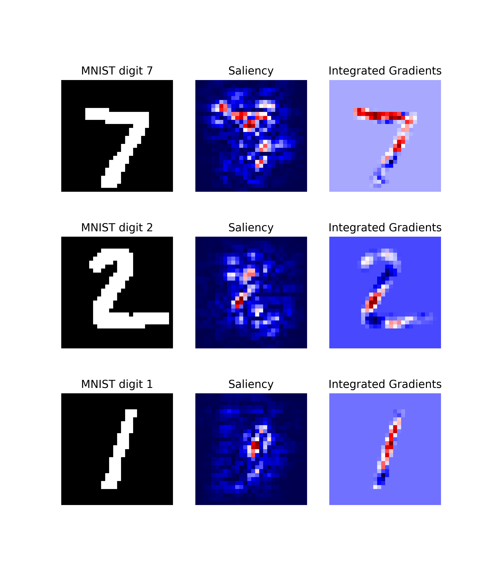

# Getting Started

The following will give a short introduction to how to get started with Quantus.

Note that this example is based on the [PyTorch](https://pytorch.org/) framework, but we also support 
[TensorFlow](https://www.TensorFlow.org), which would differ only in the {ref}`preliminaries <prelim>` 
i.e., the loading of model, data and explanations.

## Preliminaries
(prelim)=
Quantus implements methods for the quantitative evaluation of XAI methods.
Generally, in order to apply these, you will need:
* A model (`model`), inputs (`x_batch`) and labels (`y_batch`)
* Some explanations you want to evaluate (`a_batch`)

### Step 1. Load data and model

Let's first load the data and model. In this example, a pre-trained LeNet available from Quantus 
for the purpose of this tutorial is loaded, but generally, you might use any Pytorch (or TensorFlow) model instead.

```python
import quantus
from quantus import LeNet
import torch
import torchvision

# Enable GPU.
device = torch.device("cuda:0" if torch.cuda.is_available() else "cpu")

# Load a pre-trained LeNet classification model (architecture at quantus/helpers/models).
model = LeNet()
model.load_state_dict(torch.load("tests/assets/mnist_model"))

# Load datasets and make loaders.
test_set = torchvision.datasets.MNIST(root='./sample_data', download=True)
test_loader = torch.utils.data.DataLoader(test_set, batch_size=24)

# Load a batch of inputs and outputs to use for XAI evaluation.
x_batch, y_batch = iter(test_loader).next()
x_batch, y_batch = x_batch.cpu().numpy(), y_batch.cpu().numpy()
```

### Step 2. Load explanations

We still need some explanations to evaluate. 
For this, there are two possibilities in Quantus. You can provide either:
1. a set of re-computed attributions (`np.ndarray`)
2. any arbitrary explanation function (`callable`), e.g., the built-in method `quantus.explain` or your own customised function

We describe the different options in detail below.

#### a) Using pre-computed explanations

Quantus allows you to evaluate explanations that you have pre-computed, 
assuming that they match the data you provide in `x_batch`. Let's say you have explanations 
for [Saliency](https://arxiv.org/abs/1312.6034) and [Integrated Gradients](https://arxiv.org/abs/1703.01365)
already pre-computed.

In that case, you can simply load these into corresponding variables `a_batch_saliency` 
and `a_batch_intgrad`:

```python
a_batch_saliency = load("path/to/precomputed/saliency/explanations")
a_batch_saliency = load("path/to/precomputed/intgrad/explanations")
```

Another option is to simply obtain the attributions using one of many XAI frameworks out there, 
such as [Captum](https://captum.ai/), 
[Zennit](https://github.com/chr5tphr/zennit), 
[tf.explain](https://github.com/sicara/tf-explain),
or [iNNvestigate](https://github.com/albermax/innvestigate). The following code example shows how to obtain explanations ([Saliency](https://arxiv.org/abs/1312.6034) 
and [Integrated Gradients](https://arxiv.org/abs/1703.01365), to be specific) 
using [Captum](https://captum.ai/):

```python
import captum
from captum.attr import Saliency, IntegratedGradients

# Generate Integrated Gradients attributions of the first batch of the test set.
a_batch_saliency = Saliency(model).attribute(inputs=x_batch, target=y_batch, abs=True).sum(axis=1).cpu().numpy()
a_batch_intgrad = IntegratedGradients(model).attribute(inputs=x_batch, target=y_batch, baselines=torch.zeros_like(x_batch)).sum(axis=1).cpu().numpy()

# Save x_batch and y_batch as numpy arrays that will be used to call metric instances.
x_batch, y_batch = x_batch.cpu().numpy(), y_batch.cpu().numpy()

# Quick assert.
assert [isinstance(obj, np.ndarray) for obj in [x_batch, y_batch, a_batch_saliency, a_batch_intgrad]]
```

#### b) Passing an explanation function

If you don't have a pre-computed set of explanations but rather want to pass an explanation function 
that you wish to evaluate with Quantus, this option exists. 

For this, you can rely on the built-in `quantus.explain` function, which includes some popular explanation methods 
(please run `quantus.available_methods()` to see which ones). Note, however, that the set of explanation methods offered 
in `quantus.explain` are limited --- `quantus.explain` is a wrapper around  [Captum](https://captum.ai/), 
[Zennit](https://github.com/chr5tphr/zennit), and
[tf.explain](https://github.com/sicara/tf-explain) but does not support every explanation method offered in the 
respective libraries. 

If you want to use Quantus to evaluate any arbitrary explanation method (e.g., your newly built explanation function),
you can simply provide your own function (`callable`, see also {ref}`Extending quantus <extend>`). 
Examples of how to use `quantus.explain` 
or your own customised explanation function are included in the next section.


As seen in the above image, the qualitative aspects of explanations 
may look fairly uninterpretable --- since we lack ground truth of what the explanations
should be looking like, it is hard to draw conclusions about the explainable evidence. 

## Step 3. Evaluate explanations with Quantus

To gather quantitative evidence for the quality of the different explanation methods, we can apply Quantus.

### Initialise metrics

Quantus implements XAI evaluation metrics from different categories, 
e.g., Faithfulness, Localisation and Robustness etc which all inherit from the base `quantus.Metric` class. 
To apply a metric to your setting (e.g., [Max-Sensitivity](https://arxiv.org/abs/1901.09392)) 
it first needs to be instantiated:

```python
metric = quantus.MaxSensitivity()
```

and then applied to your model, data, and (pre-computed) explanations:

```python
scores = metric(
    model=model,
    x_batch=x_batch,
    y_batch=y_batch,
    device=device,
    explain_func=quantus.explain,
    explain_func_kwargs={"method": "Saliency"}
)
```

Since a re-computation of the explanations is necessary for robustness evaluation, in this example, we also pass an explanation function (`explain_func`) to the metric call. Here, we rely on the built-in `quantus.explain` function to recompute the explanations. The hyperparameters are set with the `explain_func_kwargs` dictionary. Please find more details on how to use  `quantus.explain` at [API documentation](https://quantus.readthedocs.io/en/latest/docs_api/quantus.functions.explanation_func.html).

You can alternatively use your own customised explanation function
(assuming it returns an `np.ndarray` in a shape that matches the input `x_batch`). This is done as follows:

```python
def your_own_callable(model, inputs, targets, **kwargs) -> np.ndarray:
  """Logic goes here to compute the attributions and return an 
  explanation  in the same shape as x_batch (np.array), 
  (flatten channels if necessary)."""
  return explanation(model, inputs, targets)

scores = metric(
    model=model,
    x_batch=x_batch,
    y_batch=y_batch,
    device=device,
    explain_func=your_own_callable
)
```

### Customising metrics

The metrics for evaluating XAI methods are often quite sensitive to their respective hyperparameters. 
For instance, how explanations are normalised or whether signed or unsigned explanations are considered can have a significant
impact on the results of the evaluation. However, some metrics require normalisation or unsigned values, while others are more flexible.

Therefore, different metrics can have different hyperparameters or default values in Quantus, which are documented in detail 
{doc}`here </docs_api/modules>`. We encourage users to read the respective documentation before applying each metric, 
to gain an understanding of the implications of altering each hyperparameter.

To get an overview of the hyperparameters for a specific metric, please run:
```python
metric.get_params
```
Nevertheless, for the purpose of robust evaluation, it makes sense to vary especially those hyperparameters that metrics tend to be
sensitive to. Generally, hyperparameters for each metric are separated as follows:

* Hyperparameters affecting the metric function itself are set in the `__init__` method of each metric. 
  Extending the above example of MaxSensitivity, various init hyperparameters can be set as follows:
    ```python
    max_sensitivity = quantus.MaxSensitivity(
        nr_samples=10,
        lower_bound=0.2,
        norm_numerator=quantus.fro_norm,
        norm_denominator=quantus.fro_norm,
        perturb_func=quantus.uniform_noise,
        similarity_func=quantus.difference
    )
    ```
* Hyperparameters affecting the inputs (data, model, explanations) to each metric are set in the `__call__` method of each metric.
  Extending the above example of MaxSensitivity, various call hyperparameters can be set as follows:
    ```python
    result = max_sensitivity(
        model=model,
        x_batch=x_batch,
        y_batch=y_batch,
        device=device,
        explain_func=quantus.explain,
        explain_func_kwargs={"method": "Saliency"},
        softmax=False
    )
    ```
  
### Large-scale evaluations

Quantus also provides high-level functionality to support large-scale evaluations,
e.g., multiple XAI methods, multifaceted evaluation through several metrics, or a combination thereof.

To utilise `quantus.evaluate()`, you simply need to define two things:

1. The **Metrics** you would like to use for evaluation (each `__init__` parameter configuration counts as its own metric):
    ```python
    metrics = {
        "max-sensitivity-10": quantus.MaxSensitivity(nr_samples=10),
        "max-sensitivity-20": quantus.MaxSensitivity(nr_samples=20),
        "region-perturbation": quantus.RegionPerturbation(),
    }
    ```
   
2. The **XAI methods** you would like to evaluate, as a `dict` with pre-computed attributions:
    ```python
    xai_methods = {
        "Saliency": a_batch_saliency,
        "IntegratedGradients": a_batch_intgrad
    }
    ```
  or as a `dict` but with explanation functions:
```python
xai_methods = {
    "Saliency": saliency_callable,
    "IntegratedGradients": saliency_callable
}
```
  or as a `dict` with keys with the name of the Quantus built-in explanation methods (see `quantus.explain`), and the values are associated hyperparameters (as a `dict`):
```python
xai_methods = {
    "Saliency": {},
    "IntegratedGradients": {}
}
```

You can then simply run a large-scale evaluation as follows (this aggregates the result by `np.mean` averaging):

```python
import numpy as np
results = quantus.evaluate(
      metrics=metrics,
      xai_methods=xai_methods,
      agg_func=np.mean,
      model=model,
      x_batch=x_batch,
      y_batch=y_batch,
      call_kwargs={"0": {"softmax": False,},}
)
```

Please see [
Getting started tutorial](https://github.com/understandable-machine-intelligence-lab/quantus/blob/main/tutorials/Tutorial_Getting_Started.ipynb) to run code similar to this example.

## Extending Quantus
(extend)=

With Quantus, one can flexibly extend the library's functionality, e.g., to adopt a customised explainer function
`explain_func` or to replace a function that perturbs the input `perturb_func` with a user-defined one.
If you are extending or replacing a function within the Quantus framework, make sure that your new function:

- has the same **return type**
- expects the same **arguments**

as the function, you’re intending to replace.

Details on what datatypes and arguments should be used for the different functions can be found in the respective 
function typing in {doc}`quantus.helpers</docs_api/quantus.helpers>`. 
For example, if you want to replace `similarity_func` in your evaluation, you can do as follows.

```python
import scipy
import numpy as np

def my_similarity_func(a: np.array, b: np.array, **kwargs) -> float:
    """Calculate the similarity of a and b by subtraction."""
    return a - b

# Simply initialise the metric with your own function.
metric = quantus.LocalLipschitzEstimate(similarity_func=my_similar_func)
```

Similarly, if you are replacing or extending metrics, make sure they inherit from the `Metric` class in 
{doc}`quantus.metrics.base</docs_api/quantus.metrics.base>`. Each metric at least needs to implement the
`Metric.evaluate_instance` method.

## Miscellaneous

There are several miscellaneous helpers built into Quantus as follows:

````python
# Interpret scores of a given metric.
metric_instance.interpret_scores

# Understand the hyperparameters of a metric.
sensitivity_scorer.get_params

# To list available metrics (and their corresponding categories).
quantus.AVAILABLE_METRICS

# To list available explainable methods with tf-explain.
quantus.AVAILABLE_XAI_METHODS_TF

# To list available explainable methods with captum.
quantus.AVAILABLE_XAI_METHODS_CAPTUM

# To list available perturbation functions.
quantus.AVAILABLE_SIMILARITY_FUNCTIONS

# To list available similarity functions.
quantus.AVAILABLE_PERTURBATION_FUNCTIONS

# To list available normalisation function.
quantus.AVAILABLE_NORMALISATION_FUNCTIONS

# To get the scores of the last evaluated batch.
metric_instance_called.evaluation_scores
````

Per default, 
warnings are printed to shell with each metric initialisation in order to make the user attentive to the hyperparameters 
of the metric which may have great influence on the evaluation outcome. 
If you are running evaluation iteratively you might want to disable warnings, 
then set:

```disable_warnings = True```

in the params of the metric initalisation. Additionally, if you want to track progress while evaluating your explanations set:

```display_progressbar = True```

If you want to return an aggregate score for your test samples you can set the following hyperparameter:

```return_aggregate = True```

for which you can specify an `aggregate_func` e.g., `np.mean` to use while aggregating the score for a given metric.

## Tutorials

Further tutorials are available that showcase the many types of analysis that can be done using Quantus.
For this purpose, please see notebooks in the [tutorials](https://github.com/understandable-machine-intelligence-lab/Quantus/blob/main/tutorials/) folder which includes examples such as:
* [All Metrics ImageNet Example](https://github.com/understandable-machine-intelligence-lab/Quantus/blob/main/tutorials/Tutorial_ImageNet_Example_All_Metrics.ipynb): shows how to instantiate the different metrics for ImageNet dataset
* [Metric Parameterisation Analysis](https://github.com/understandable-machine-intelligence-lab/Quantus/blob/main/tutorials/Tutorial_Metric_Parameterisation_Analysis.ipynb): explores how sensitive a metric could be to its hyperparameters
* [Robustness Analysis Model Training](https://github.com/understandable-machine-intelligence-lab/Quantus/blob/main/tutorials/Tutorial_XAI_Sensitivity_Model_Training.ipynb): measures robustness of explanations as model accuracy increases 
* [Full Quantification with Quantus](https://github.com/understandable-machine-intelligence-lab/Quantus/blob/main/tutorials/Tutorial_ImageNet_Quantification_with_Quantus.ipynb): example of benchmarking explanation methods
* [Tabular Data Example](https://github.com/understandable-machine-intelligence-lab/Quantus/blob/main/tutorials/Tutorial_Getting_Started_with_Tabular_Data.ipynb): example of how to use Quantus with tabular data
* [Quantus and TensorFlow Data Example](https://github.com/understandable-machine-intelligence-lab/Quantus/blob/main/tutorials/Tutorial_Getting_Started_with_Tensorflow.ipynb): showcases how to use Quantus with TensorFlow

... and more.
